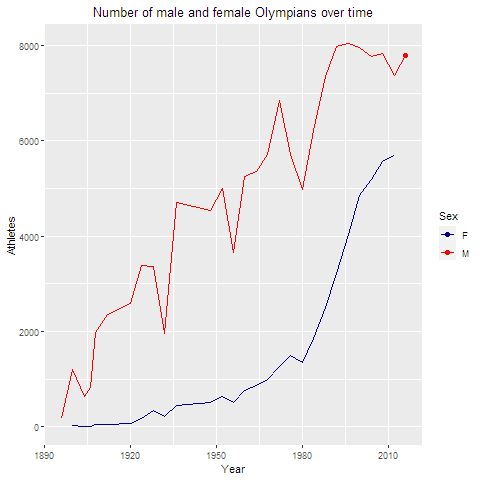

```{r setup, include=FALSE}
knitr::opts_chunk$set(echo = TRUE,  dev = "cairo_pdf")
```

## 1. Introduction

### 1.1 About

The most famous of sporting competitions are the Olympic Games, which originally took place in ancient Greece between 776 BC and 393 AD.
The first modern Games were held in 1859.
The Games have come to represent the ideal of sporting excellence \-- the "Olympian spirit" of pure athletic competition, untrammelled by worldly considerations.

Olympics has a rich history, spanning from 1896 till 2018, and has been a part of history.
So, it is an interesting topic to see how the historical events have affected the specifics of Olympics and how it has been changing till date.
Hence, this report attempts to build around the following questions, with some connection to historical happenings.

-   *The first Olympic Games had achieved major importance in Greece by the end of the 6th century BCE.*

-   *They began to lose popularity when Greece was conquered by Rome in the 2nd century BCE, and the Games were officially abolished about 400 CE because of their pagan associations.*

-   *The Olympics were revived in the late 19th century, with the first modern Games being held in Greece is 1896.*

-   *The Summer Olympic Games and Winter Olympic Games are each held every four years.*

-   *After 1992, when both a Summer and Winter Games were held, they have been held on a staggered two-year schedule so that the Olympic Games occur every two years in either summer or winter.*

-   *The International Olympic Committee chooses the location of each Olympic Games.*

-   *The choice is based on applications made by the chief authority of a city, with support of the national government.*

-   *In individual Olympic events the award for first place is a gold medal, for second place a silver medal, and for third place a bronze medal.*

-   *Diplomas are awarded for fourth through eighth places, and all competitors and officials receive a commemorative medal.*

-   *Winning a bid to host the Olympic Games has been considered a major boon for any city, but not all agree.*

-   *Proponents believe that hosting the Olympic Games can increase valuable tourism, boost local economies, and grow a host country's global trade and stature.*

-   *Others maintain, however, that the Olympics are a financial drain on host cities and force them to create expensive infrastructure and buildings that fall into disuse.*

\newpage

### 1.2 Motivation behind the project

-   *Olympics is the most prestigious sports event and it's a pride for the athletes to participate in this event and win medals for their nation.*

-   *Loads of data was available online on Olympics, so we could do a lot of things and play around to figure out the various factors that could be responsible for winning more medals and make some interesting visualizations.*

### 1.3 Interesting Questions

Here we would like to pose some captivating and enthralling questions which we can answer using our data-sets and the analysis we performed on it.

-   **Q** *Is there any sort of bias or correlation between being a host country and increasing a country's medal count?*

-   **Q** *Is the total medal count for each nation linked to it's literacy rate, per capita alcohol consumption, prices of beer, year of independence or any other sort of factor which we might be able to think about?*

-   **Q** *What are some major factors contributing to a country's success at the Olympics??*

-   **Q** *How does the Medal count of country vary over the years??*

-   **Q** *What is the Age, Weight and Height distribution of various athletes taking part in Olympics from different nations??*

-   **Q** *What has happened to the participation of Nations over the years and has the number of events over the years increased ? If YES then what is the rate.*

-   **Q** \*Has Olympics become a popular among people??

```{r message = FALSE}
#| echo: false
library(hrbrthemes)
library(ggplot2)
library(Cairo)
library(extrafont)
library(gridExtra)

extrafont::loadfonts()
```

\newpage

## 2. Data

### 2.1 Dataframes

To get started, we collected the total count of medals won by different countries over the years(1896 - 2020).
We also collected the various other factors of the countries like literacy rate, population, life expectancy, BMI, per capita alcohol consumption, etc.
These demographic details were the latest we could find, i.e., for year 2020.
The data containing the list of athletes and their sex, age, height, weight, medals won was collected.

Overall, we primarily had three datasets:

i)  ***FinalYearwiseMedals.Rdata*** : This data frame contained the year-wise(gold, silver, bronze and total) medals won by various countries over the years. Alse the host nation for that year is also mentioned in a column. This data contains 2071 observations with 8 variables. The features of this dataframe are as follows:

-   ***year** : The years in which the Olympic games were organised.*

-   ***Rank** : Rank of the nation in the specified year.*

-   ***Nation** : Name of the country.*

-   ***Gold** : Number of gold medals won by the specified country in a particular year.*

-   ***Silver** : Number of silver medals won by the specified country in a particular year.*

-   ***Bronze** : Number of bronze medals won by the specified country in a particular year.*

-   ***Total** : Total number of medals medals won by the specified country in a particular year.*

-   ***Host** : Name of the country that hosted the event in the specified year.*

Few observations of this dataframe is as follows:

```{r FinalYearwiseMedals.Rdata , echo=FALSE}
load("data/FinalYearwiseMedals.Rdata")
head(dat_year)
```

ii) ***FinalTotalMedals.Rdata*** : This data frame contained the total number of medals (gold, silver and total) won by different nations over the history of olympics. This dataset also contains various demographic details of the nations like population(scaled down by 1000), literacy rate, life expectancy, BMI, alcohol consumption, etc. We could find the yearwise data of these demographic details of various countries, so we got the most recent ( as of 2020) data we could find. Also, the year of independence of the various nations were added in this dataset. There were a total of 2071 observations and 8 variables in this dataset. The features of this dataframe are as follows:

-   ***Nation** : Name of the country.*
-   ***Gold** : Cumulative number of gold medals won by the country over the years.*
-   ***Silver** : Cumulative number of silver medals won by the country over the years.*
-   ***Bronze** : Cumulative number of bronze medals won by the country over the years.*
-   ***Total** : Total number of medals won by the country over the years.*
-   ***Literacy** : Literacy rate of the country.*
-   ***pop** : Population of the country(scaled down by 1000).*
-   ***lifeExp** : Lifr Expectancy.*
-   ***BMI** : Average BMI of the nation.*
-   ***alchol_consum** : Rate of alcohol consumption.*
-   ***forest_area** : Proportion of forest cover in the country.*
-   ***BeerPrice** : Beer price in the country.*
-   ***Indep_year** : Year of independence.*
-   ***suicide_rate** : Suicide Rate*
-   ***unemployment_rate**(%) : Unemployment rate.*

Few observations of this dataframe is as follows:

```{r FinalTotalMedals.Rdata , echo=FALSE }
load("data/FinalTotalMedals.Rdata")
head(dat[,1:8])
head(dat[,9:14])
```

iii) ***height_age_weight.Rdata*** : The sex, age, height weight and Nation of the various athletes is contained in this dataset. This is the largest dataset we collected that contained information about 206165 athletes with 5 variables. The features of this dataframe are as follows:

-   ***Sex** : Sex of specific the player.*
-   ***Age** : Age of the athlete.*
-   ***Height** : Height of the athlete.*
-   ***Weight** : Weight of the athlete.*
-   ***Nation**: Name of the country, which the athlete represents.*

```{r height_age_weight.Rdata , echo=FALSE}
load("data/height_age_weight.Rdata")
head(haw)
```

### 2.2 Data extraction

We used the "rvest" library of R to extract the data from various websites.

-   *Firstly, we got the all-time total medals won by the countries from the following website: <https://en.wikipedia.org/wiki/All-time_Olympic_Games_medal_table>*

-   *The point table for the year 2020 was extracted from the following website: <https://olympics.com/en/olympic-games/tokyo-2020/medals> Similarly the points table for different years were collected and merge in a single dataframe.*

-   *The following websites were scrapped to extract the various demographic details of the countries:*

    -   [*https://worldpopulationreview.com/country-rankings/literacy-rate-by-country*](https://worldpopulationreview.com/country-rankings/literacy-rate-by-country){.uri}
    -   [*https://en.wikipedia.org/wiki/List_of_countries_by_body_mass_index*](https://en.wikipedia.org/wiki/List_of_countries_by_body_mass_index){.uri}

The data which contained the names, sex, age, height and weight of various athletes participated in olympics over the years was downloaded from the following website in .csv format and cleaned further.

-   [*https://www.kaggle.com/datasets/heesoo37/120-years-of-olympic-history-athletes-and-results?select=athlete_events.csv*](https://www.kaggle.com/datasets/heesoo37/120-years-of-olympic-history-athletes-and-results?select=athlete_events.csv){.uri}

### 2.3 Data Cleaning

Now lets move to a very crucial part of data analysis, that is data cleaning.We have loads of Data around us, but it is not useful to us if it is not in an organized and regular manner on which we can operate and draw conclusion.

-   Since we used multiple factors for each nation, each dataframe was merged together along the Nation using the "merge" function.

-   Our data sets had **2 major issues** with respect to data cleaning:

    1.  **Irregularities in names of countries :**

    {fig-align="center"}

    2.  **Na values corresponding to some factors :**

    {fig-align="center"}

-   Let's see how we dealt with these issues:

    -   To clean the name of countries.The **stringr** package was used. first we split the name into characters and then depending on the present irregularity like "\*"/"()" / "[]" we make a subset of the data-set then clean it accordingly.

    {fig-align="center"}

    -   while merging data on different factors based on the nation some null entities were introduced in the dataframe, so of them had to be filled manually and rest were dropped using "na.omit" \### 2.4 Key Questions of Interest

The purpose of our analysis was to answer some, if not all, of the following questions:

-   *Which are the top performing countries in Olympics and does the various demographic factors like life expectancy, literacy rate, year of independence, etc. affect the medal count of a country?*

-   *Has popularity of Olympics increased over the years ?*

-   *What is the age, height and weight distribution of the athletes ?*

-   *Does hosting the event increase the chances of winning more medals ?* \newpage

## 3. Analysis and visualization

### 3.1 **Race for Medals**

-   *First of all We we wanted to analyze where the various nations lie in terms of the number of medals like gold/silver/bronze and the total Number of Medals which each nation has won till date.*

-   *So basically the following graph depicts that. You can select the Nations you want to see on the leader-board and then we'll depict the ranks for each type of medals.*

```{r}
#| echo: false
#| eval: true
#| include: false
library(ggplot2)
library(patchwork)
library(tidyverse)

load(file = "data/FinalTotalMedals.Rdata")

plot2_total <- function(dat){
  
  # dat : data-set used to plot
  
  p2_total <- ggplot(dat, aes(y = fct_reorder(Nation, Total, .desc = F), x = Total))+
    geom_segment(aes(y = fct_reorder(Nation, Total, .desc = F),
                     yend = fct_reorder(Nation, Total, .desc = F),
                     x = 0,
                     xend = Total),
                 color = "cyan",
                 lwd = 2)+
    geom_point(color = "cyan", size = 8, alpha=0.6, pch = 16)+
    geom_text(aes(label = Total), color = 'black', size = 2)+
    theme_light()+
    theme(
      plot.title = element_text(size = 20,
                                face = "bold",
                                color = 'grey28',
                                hjust = 0.5,
                                lineheight = 1.2),
      axis.text = element_text(size = 10,
                               face = "bold"),
      panel.grid.major.x = element_blank(),
      axis.ticks.y = element_blank(),
      panel.border = element_blank(),
      axis.title = element_text(face = "bold",
                                size = 10)
    )+
    labs(x = "Number of Total Medals",
         y = "Nation",
         title = "Race For Medals")
  
  return (p2_total)
}

plot2_gold <- function(dat){
  
  # dat : data-set used to plot
  
  p2_gold <- ggplot(dat, aes(y = fct_reorder(Nation, Gold, .desc = F), x = Gold))+
    geom_segment(aes(y = fct_reorder(Nation, Gold, .desc = F),
                     yend = fct_reorder(Nation, Gold, .desc = F),
                     x = 0,
                     xend = Gold),
                 color = "goldenrod3",
                 lwd = 2)+
    geom_point(color = "darkgoldenrod", size = 8, alpha=0.6, pch = 16)+
    geom_text(aes(label = Gold), color = 'white', size = 2)+
    theme_light()+
    theme(
      plot.title = element_text(size = 20,
                                face = "bold",
                                color = 'grey28',
                                hjust = 0.5,
                                lineheight = 1.2),
      axis.text = element_text(size = 10,
                               face = "bold"),
      panel.grid.major.x = element_blank(),
      axis.ticks.y = element_blank(),
      panel.border = element_blank(),
      axis.title = element_text(face = "bold",
                                size = 10)
    )+
    labs(x = "Number of Gold Medals",
         y = "Nation",
         title = "Race of Nations for GOLD")
  
  return (p2_gold)
}


plot2_silver <- function(dat){
  
  # dat : data-set used to plot
  
  p2_silver <- ggplot(dat, aes(y = fct_reorder(Nation, Silver, .desc = F), x = Silver))+
    geom_segment(aes(y = fct_reorder(Nation, Silver, .desc = F),
                     yend = fct_reorder(Nation, Silver, .desc = F),
                     x = 0,
                     xend = Silver),
                 color = "grey50",
                 lwd = 2)+
    geom_point(color = "grey28", size = 8, alpha=0.6, pch = 16)+
    geom_text(aes(label = Silver), color = 'white', size = 2)+
    theme_light()+
    theme(
      plot.title = element_text(size = 20,
                                face = "bold",
                                color = 'grey28',
                                hjust = 0.5,
                                lineheight = 1.2),
      axis.text = element_text(size = 10,
                               face = "bold"),
      panel.grid.major.x = element_blank(),
      axis.ticks.y = element_blank(),
      panel.border = element_blank(),
      axis.title = element_text(face = "bold",
                                size = 10)
    )+
    labs(x = "Number of Silver Medals",
         y = "Nation",
         title = "Race of Nations for Silver")
  
  return (p2_silver)
}

plot2_bronze <- function(dat){
  
  # dat : data-set used to plot
  
  p2_bronze <- ggplot(dat, aes(y = fct_reorder(Nation, Bronze, .desc = F), x = Bronze))+
    geom_segment(aes(y = fct_reorder(Nation, Bronze, .desc = F),
                     yend = fct_reorder(Nation, Bronze, .desc = F),
                     x = 0,
                     xend = Bronze),
                 color = "#cd7f32",
                 lwd = 2)+
    geom_point(color = "#a46628", size = 8, alpha=0.6, pch = 16)+
    geom_text(aes(label = Bronze), color = 'white', size = 2)+
    theme_light()+
    theme(
      plot.title = element_text(size = 20,
                                face = "bold",
                                color = 'grey28',
                                hjust = 0.5,
                                lineheight = 1.2),
      axis.text = element_text(size = 10,
                               face = "bold"),
      panel.grid.major.x = element_blank(),
      axis.ticks.y = element_blank(),
      panel.border = element_blank(),
      axis.title = element_text(face = "bold",
                                size = 10)
    )+
    labs(x = "Number of Bronze Medals",
         y = "Nation",
         title = "Race of Nations for Bronze")
  
  return (p2_bronze)
}

nations <- unique(dat$Nation)[1:12]
temp <- subset(dat, Nation %in% nations)

u <- plot2_total(temp)+plot2_gold(temp)
v <- plot2_silver(temp)+plot2_bronze(temp)
```

```{r dev = "cairo_pdf", fig.align='center', fig.height =4 , fig.width = 12}
#| echo: false
#| eval: true
#| include: true
u
v
#plot2_total(temp)
#lot2_gold(temp)
#plot2_silver(temp)
#plot2_bronze(temp)
```

\newpage

### 3.2 **Evolution of Medals**

-   *Next we wanted to study the year-wise distribution of medals for each Nation and the important thing we wanted to see was does* **hosting the Olympics** *for a particular nation implies that it will win more medals.*

-   *In the following graph we have used* **United States** *as an example to depict the above Hypothesis. We can see that among st all the Peaks most of the peaks are those in which US has hosted the Olympics. So it might be the case that the Olympians feel more confident in their home-ground or there is some other sort of bias.*

-   *This was observed for a few other countries as well like Greece, France, etc.*

```{r dev = "cairo_pdf", fig.align='center', fig.height = 4, fig.width = 6}
#| echo: false
#| eval: true
#| include: true

load("data/FinalYearWiseMedals.Rdata")

nation = "United States"
temp <- subset(dat_year, Nation == nation)
bias <- subset(temp, HostNation == nation)

plot_host <- function(dat, bias, nation){
  
  p1 <- ggplot(dat, aes(y = Total, x = year))+
    geom_line(col = 'black')+
    geom_point(color = 'cyan',
               size = 5,
               pch = 16,
               alpha = 0.8)+
    geom_point(aes(x = year, y = Total),
               col = "cyan",
               size = 12,
               pch = 16,
               data = bias)+
    geom_label(label = "Host", size = 4, data = bias, alpha = 0.6)+
    theme_light()+
    labs(x = "Year",
         y = "Total Number of Medals",
         title = "Evolution of Medals",
         subtitle = paste("(", nation, ")"))+
    theme(
      plot.title = element_text(size = 15,
                                face = "bold",
                                color = 'grey28',
                                hjust = 0.5,
                                lineheight = 0.5),
      plot.subtitle = element_text(size = 10,
                                   face = "bold",
                                   color = 'grey28'),
      axis.text = element_text(size = 10,
                               face = "bold"),
      axis.title = element_text(face = "bold",
                                size = 10),
      panel.grid.major.x = element_blank(),
      axis.ticks.y = element_blank(),
      panel.border = element_blank()
    )+
    coord_cartesian(xlim = c(1896, 2020))+
    scale_x_continuous(breaks = seq(1896, 2020, 31))
  
  p1
}

plot_host(temp, bias, nation)
```

\newpage

### 3.3 **Various Factors Used**

-   *Next we are looking at the plots of Total Medals of each country against the factor which was used to calculate the correlation.*

-   *Here the line Drawn in each plot is representing the line of best fit according to a linear model.*

-   *The 4 Factors which had highest correlation were as follows:*

**Note: Here the "total number of medals" means the cumulative sum of gold, silver and bronze medals which a country has won over time.**

i)**Life Expectancy** :

*This factor was kind of obvious since higher life expectancy implies higher fitness levels and more fit people will definitely win more medals in the Olympics.Thus, Life expectancy showed* **positive correlation.**

```{r dev = "cairo_pdf",fig.align='center', fig.height = 4, fig.width = 6}
#| echo: false
#| eval: true
#| include: true
plot_lifeExp <- function(){
  ggplot(dat, aes(y = Total, x = lifeExp))+
    geom_point()+
    geom_smooth(method = lm,se = F,
                col = "skyblue")+
    labs(y = "Total Number of Medals",
         x = "Life Expectancy")+
    theme(
      plot.title = element_text(size = 20,
                                face = "bold",
                                color = 'grey28',
                                hjust = 0.5,
                                lineheight = 0.5),
      plot.subtitle = element_text(size = 15,
                                   face = "bold",
                                   color = 'grey28'),
      axis.text = element_text(size = 15,
                               face = "bold"),
      axis.title = element_text(face = "bold",
                                size = 15),
      axis.ticks.y = element_blank()
    )
}

plot_lifeExp()
```

\newpage

ii)**Price of Beer (in USD) per 500ml** :

-   *This factor was pretty amusing for us as well. The important thing to note is here is that we got correlation but we also know that correlation does not imply causation.*

-   *So if we consider that, then there might be a confounding variable involved which is affecting both the factors under consideration, .ie Prices of beer and the total number of medals.*

-   *On the other hand if consider causation we got to the conclusion that if the beer is cheap, people will drink more beer and will be happy and happy people tend to be more efficient in whatever they do, so they will win more medals.Prices of Beer showed* **negative correlation** *with the total number of medals won.*

```{r dev = "cairo_pdf", fig.align='center', fig.height = 4, fig.width = 6}
#| echo: false
#| eval: true
#| include: true
plot_beer <- function(){
  ggplot(dat, aes(y = Total, x = BeerPrice))+
    geom_point()+
    geom_smooth(method = lm,se = F,
                col = "darkgrey", lwd = 2)+
    labs(y = "Total Number of Medals",
         x = "Beer Price")+
    theme(
      plot.title = element_text(size = 20,
                                face = "bold",
                                color = 'grey28',
                                hjust = 0.5,
                                lineheight = 0.5),
      plot.subtitle = element_text(size = 15,
                                   face = "bold",
                                   color = 'grey28'),
      axis.text = element_text(size = 12,
                               face = "bold"),
      axis.title = element_text(face = "bold",
                                size = 15),
      axis.ticks.y = element_blank()
    )
}

plot_beer()
```

\newpage

iii)**Per Capita alcohol consumption** :

-   *This factor also follows the same discussion as the factor "Price of Beer". It showed* **positive correlation** *with the total number of medals won.*

```{r dev = "cairo_pdf", fig.align='center', fig.height = 4, fig.width = 6}
#| echo: false
#| eval: true
#| include: true
plot_alcohol <- function(){
  ggplot(dat, aes(y = Total, x = alchol_consum))+
    geom_point()+
    geom_smooth(method = lm,se = F,
                col = "cyan")+
    labs(y = "Total Number of Medals",
         x = "Per Capita Alchol Consumption")+
    theme(
      plot.title = element_text(size = 20,
                                face = "bold",
                                color = 'grey28',
                                hjust = 0.5,
                                lineheight = 0.5),
      plot.subtitle = element_text(size = 15,
                                   face = "bold",
                                   color = 'grey28'),
      axis.text = element_text(size = 12,
                               face = "bold"),
      axis.title = element_text(face = "bold",
                                size = 15),
      axis.ticks.y = element_blank()
    )
}

plot_alcohol()
```

\newpage

iv)**Year of Independence** :

-   *We wanted to check whether year of independence had any effect on the leader-board and it actually did.*

-   *The countries which got independence later tend to be on the bottom of the leader-board and vice-versa. Thus, Year of Independence showed* **negative correlation** *with the total number of medals won.*

```{r dev = "cairo_pdf", fig.align='center', fig.height = 4, fig.width = 6}
#| echo: false
#| eval: true
#| include: true
plot_indep <- function(){
  ggplot(dat, aes(y = Total, x = Indep_year))+
    geom_point()+
    geom_smooth(method = lm,se = F,
                col = "yellow")+
    labs(y = "Total Number of Medals",
         x = "Year of Independence")+
    theme(
      plot.title = element_text(size = 20,
                                face = "bold",
                                color = 'grey28',
                                hjust = 0.5,
                                lineheight = 0.5),
      plot.subtitle = element_text(size = 15,
                                   face = "bold",
                                   color = 'grey28'),
      axis.text = element_text(size = 12,
                               face = "bold"),
      axis.title = element_text(face = "bold",
                                size = 15),
      axis.ticks.y = element_blank()
    )
}

plot_indep()
```

\newpage

### 3.4 **Distribution of Age, Weight and Height**

-   *We wanted to study how the various factors like age, weight and height are distributed considering all the athletes in the various events that take place in Olympics.*

-   *First let's have a look at the* **Age** *factor:*

-   *We found out through our analysis that the average age of Olympians was in the range of* **24 to 28** *, the lowest being 13 and highest being 72(in the shooting category).*

-   *In the following plot you can basically select the country for which you want to see the distribution of age and the following plot will be displayed:*

```{r dev = "cairo_pdf"}
#| echo: false
#| eval: true
#| include: false
load("data/height_age_weight.Rdata")
nation = "Greece"
temp <- subset(haw, Nation == nation)
```

```{r dev = "cairo_pdf", fig.align='center', fig.height = 4, fig.width = 6}
#| echo: false
#| eval: true
#| include: true
# Given a country plot the distribution of height
plot_age <- function(temp, nation){
  
  ggplot(temp, aes(x = Age, fill = Sex))+
    theme_classic()+
    scale_fill_brewer(palette = "Spectral")+
    geom_histogram(col = "black",
                   size = .2)+
    labs(x = "Age(years)",
         y = "Count",
         title = "Distribution of Age",
         subtitle = nation)+
    theme(
      plot.title = element_text(size = 20,
                                face = "bold",
                                color = 'grey28',
                                hjust = 0.5,
                                lineheight = 0.5),
      plot.subtitle = element_text(size = 15,
                                   face = "bold",
                                   color = 'grey28'),
      axis.text = element_text(size = 12,
                               face = "bold"),
      axis.title = element_text(face = "bold",
                                size = 15),
      panel.grid.major.x = element_blank(),
      axis.ticks.y = element_blank()
    )
}

plot_age(temp, nation)
```

\newpage

#### Distribution over Weight

-   *Now let's look at the* **Weight** *factor:*

-   *We concluded through our analysis that the average weight of male Olympian was* **80.1 kg** *and that of female Olympian was* **62.6 kg** *and the overall average came down to* **70.69 kg***.*

-   *Similar to the above plot you can choose the nation you want to view and we'll give you the distribution of weight for that nation.*

```{r dev = "cairo_pdf", fig.align='center', fig.height = 4, fig.width = 6}
#| echo: false
#| eval: true
#| include: true
# Given a country plot the distribution of Weight

plot_weight <- function(temp, nation){
  
  ggplot(temp, aes(x = Weight, fill = Sex))+
    theme_classic()+
    geom_histogram(col = "black",
                   size = .2)+
    labs(x = "Weight(in Kgs)",
         y = "Count",
         title = "Distribution of Weight",
         subtitle = nation)+
    theme(
      plot.title = element_text(size = 20,
                                face = "bold",
                                color = 'grey28',
                                hjust = 0.5,
                                lineheight = 0.5),
      plot.subtitle = element_text(size = 15,
                                   face = "bold",
                                   color = 'grey28'),
      axis.text = element_text(size = 12,
                               face = "bold"),
      axis.title = element_text(face = "bold",
                                size = 15),
      panel.grid.major.x = element_blank(),
      axis.ticks.y = element_blank()
    )
}

plot_weight(temp, nation)
```

\newpage

#### Distribution over Height

-   *Now time to analyse the last factor which is***Height***:*

-   *What we observed was that the Median Height is* **175 cm***and the 168 cm, 183 cm are the lower and the upper quartile respectively.*

-   *The* **maximum** *height for our data-set was observed to be* **226cm** *and the* **minimum** *being* **127cm***. Giving some context the* **average global height** *of a male is* **171cm** *and that of female is* **160cm** *only.*

-   *Similar to the above two plots you can choose the nation you want to view and we'll give you the distribution of height for that nation.*

*the plot is as follows:*

```{r dev = "cairo_pdf", fig.align='center', fig.height = 4, fig.width = 6}
#| echo: false
#| eval: true
#| include: true
plot_height <- function(temp, nation){
  
  ggplot(temp, aes(x = Height, fill = Sex))+
    theme_classic()+
    scale_fill_brewer()+
    geom_histogram(col = "black",
                   size = .2)+
    labs(x = "Height(in cms)",
         y = "Count",
         title = "Distribution of Height",
         subtitle = nation)+
    theme(
      plot.title = element_text(size = 20,
                                face = "bold",
                                color = 'grey28',
                                hjust = 0.5,
                                lineheight = 0.5),
      plot.subtitle = element_text(size = 15,
                                   face = "bold",
                                   color = 'grey28'),
      axis.text = element_text(size = 12,
                               face = "bold"),
      axis.title = element_text(face = "bold",
                                size = 15),
      panel.grid.major.x = element_blank(),
      axis.ticks.y = element_blank()
    )
}

plot_height(temp, nation)
```

\newpage

### 3.5 **Some more Graphs**

#### Top performing nations

We wanted to get an idea of top performing countries of each olympic session so we plotted a bar graph representing the top 6 countries on the basis of total medals won by the country's athletes.

-   *The bars of the graph is further sub-divided into number of gold, silver and bronze.*

-   *We can see year-wise trend country's and see whether top spots changes or not.*

-   *By observing some previous Olympics data we come to conclusion that top countries consistently maintains there performance.*

```{r dev = "cairo_pdf", fig.align='center', fig.height = 4, fig.width = 6}
#| echo: false
#| eval: true
#| include: true
load("data/olympics.Rdata")
barchartdata <-
  olympics %>%
  filter(!is.na(medal),
         year == 2016, 
         season == 'Summer') %>%
  mutate(team = gsub('-[0-9]+', '', team)) %>%
  distinct(team, event, medal) %>%
  count(team, medal) %>% 
  mutate(medal = factor(medal, levels = c("Gold", "Silver", "Bronze"))) %>% 
  group_by(team) %>%
  arrange(medal) %>% 
  ungroup() %>% 
  add_count(team, wt = n, name = "num_medals") %>% 
  mutate(rank = dense_rank(desc(num_medals))) 

barchartdatatop <-
  barchartdata %>%
  filter(rank %in% 1:5) 

if (length(unique(barchartdatatop$team)) > 10){
  barchartdatatop <-
    barchartdata %>%
    filter(rank %in% 1:3) 
}

barchartdatatop %>% 
  ggplot(aes(x = reorder(team, -num_medals), y = n, fill = medal)) +
  geom_bar(stat = "identity", position = "stack") +
  theme_minimal() +
  geom_text(aes(label = paste0(n, " ", medal)), position = position_stack(vjust = 0.5), 
            color = "white", size = 4, fontface = "bold") +
  stat_summary(fun = sum, aes(label = paste(..y.., "medals"), group = team), 
               geom = "text", vjust = -.3, size = 3) +
  labs(title = paste0("Top ", length(unique(barchartdatatop$team)), " Teams in the ", 2016, " ", "Summer", 
                      " Olympic Games"),
       x = "Team",
       y = "Number of Medals Won") +
  scale_fill_manual("legend", values = c("Gold" = "gold", "Silver" = "#C0C0C0", 
                                         "Bronze" = "#cd7f32")) + 
  theme(legend.position = "none") 

```

#### Olympics Evolution

Here we have some line graphs depicting the evolution of the Olympics, like a graph of the total nations participating in the Olympics over the and plot of total events over the year.

-   *The graph clearly shows that the number of nations participating in the Olympics has increased over time; even after world war-1, there was an increase in the number of countries participating in the Olympics.*

-   *We can also see a peak in the number of events in the Olympics after world war-1 and thought that it was done to get a decent number of participation in sports after the war.*

-   *The number of athletes participating over the year shows an overall increasing trend, but there are some dips; for example, the number of participants decreased after world war-2.*

```{r dev = "cairo_pdf", fig.align='center', fig.height = 4, fig.width = 6}
#| echo: false
#| eval: true
#| include: true
load("data/counts.Rdata")
p2 <- ggplot(counts, aes(x=Year, y=Nations, group=interaction(Season,gap), color=Season)) +
      geom_point(size=2) +
      geom_line() +
      scale_color_manual(values=c("darkorange","darkblue")) +
      xlab("") 
    p3 <- ggplot(counts, aes(x=Year, y=Events, group=interaction(Season,gap), color=Season)) +
      geom_point(size=2) +
      geom_line() +
      scale_color_manual(values=c("darkorange","darkblue"))
    grid.arrange(p2, p3, ncol=1)
```

```{r echo=FALSE, out.width = "60%", fig.align = "center"}

```

This concludes our **Analysis and Visualization** part of the project.

\newpage

## 4. Conclusion

-   *It can be clearly seen from the plots that there has been an exponential increase in the participation of countries and athletes. Also the number of events has increased, which shows that the popularity of the Olympics has increased over the years.*

-   *It can also be concluded that the countries which got independence early tend to win more medals.*

-   *The countries having higher life expectancy, higher per capita alcohol consumption won more medals than others.*

-   *And the medal count decreased with increase in unemployment rate.*

-   *Germany and Sweden were among the top performing countries.*

-   *With few nations we can observe that when they hosted the Olympics their Medals won sought to increase. (USA, Sweden, etc)*

-   *The Average age of Olympians was in the range of 24-28.(Highest was 72).*

    \newpage

## 5. References

-   [*https://shiny.rstudio.com/gallery*](https://shiny.rstudio.com/gallery)

-   [*https://worldpopulationreview.com/country-rankings/olympic-medals-by-country*](https://worldpopulationreview.com/country-rankings/olympic-medals-by-country)

-   [*https://triemann.ca/wp-content/uploads/2021/01/Olympic-Analysis_Riemann_Nicol.pdf*](https://triemann.ca/wp-content/uploads/2021/01/Olympic-Analysis_Riemann_Nicol.pdf)

-   [*https://en.wikipedia.org/wiki/List_of_countries_by_forest_area*](https://en.wikipedia.org/wiki/List_of_countries_by_forest_area)

-   [*https://en.wikipedia.org/wiki/List_of_countries_by_alcohol_consumption_per_capita*](https://en.wikipedia.org/wiki/List_of_countries_by_alcohol_consumption_per_capita)

-   [*https://en.wikipedia.org/wiki/List_of_national_independence_days*](https://en.wikipedia.org/wiki/List_of_national_independence_days)

-   [*https://www.kaggle.com/datasets/heesoo37/120-years-of-olympic-history-athletes-and-results*](https://www.kaggle.com/datasets/heesoo37/120-years-of-olympic-history-athletes-and-results)

-   [*https://en.wikipedia.org/wiki/List_of_countries_by_life_expectancy*](
https://en.wikipedia.org/wiki/List_of_countries_by_life_expectancy)

-   [*https://en.wikipedia.org/wiki/List_of_countries_by_body_mass_index*](https://en.wikipedia.org/wiki/List_of_countries_by_body_mass_index)

-   [*Beer prices*](https://cutt.ly/AMK6Hog)

-   [*Suicide Rate*](https://worldpopulationreview.com/country-rankings/suicide-rate-by-country)
